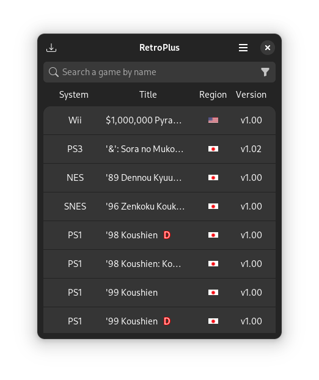

<h1 align="center">
    
    <br><br>
    RetroPlus
</h1>

<p align="center">
  <strong>A simple ROM downloader</strong>
</p>

<p align="center">
    <a href="https://github.com/Vysp3r/RetroPlus/stargazers">
      
    </a>
    <a href="https://github.com/Vysp3r/RetroPlus/releases/latest">
      
    </a>
    <a href="https://github.com/Vysp3r/RetroPlus/blob/main/LICENSE.md">
      
    </a>
    <a href="https://t.me/RetroPlusOfficial">
      
    </a>
    <a href="https://discord.gg/Fyf8bWexpQ">
      
    </a>
</p>

<p align="center">
  <a href="https://stopthemingmy.app">
    
  </a>
</p>

<p align="center">
    <i>Join the <a href="https://t.me/RetroPlus">Telegram</a>/<a href="https://discord.gg/Fyf8bWexpQ">Discord</a>! — Don't forget to star the repo if you are enjoying the project!</i>
</p>

<p align="center">
    
</p>

- - - -

## 🏗️ Building from source

<details>
  <summary>Requirements</summary>

- [git](https://github.com/git/git)
- [ninja](https://github.com/ninja-build/ninja)
- [meson >= 0.62.0](https://github.com/mesonbuild/meson)
- [gtk4](https://gitlab.gnome.org/GNOME/gtk/)
- [libadwaita >= 1.4](https://gitlab.gnome.org/GNOME/libadwaita)
- [json-glib](https://gitlab.gnome.org/GNOME/json-glib)
- [libsoup](https://gitlab.gnome.org/GNOME/libsoup)
- [desktop-file-utils](https://gitlab.freedesktop.org/xdg/desktop-file-utils)
- [libgee](https://gitlab.gnome.org/GNOME/libgee)
</details>


<details>
  <summary>Fedora</summary>

1. Install all dependencies:
    ```bash
    sudo dnf install \
      git \
      ninja-build \
      meson \
      gtk4-devel \
      libadwaita-devel \
      json-glib-devel \
      libsoup3-devel \
      desktop-file-utils \
      libgee-devel
    ```

2. Clone the GitHub repo and change to repo directory:
    ```bash
    git clone https://github.com/Vysp3r/RetroPlus.git && \
      cd RetroPlus
    ```

3. Build the source:
    ```bash
    meson build --prefix=/usr && \
    cd build && \
    ninja
    ```

4. (Optional) Install application:
    ```bash
    ninja install
    ```

5. Start application:
    ```bash
    cd src && \
    ./com.vysp3r.RetroPlus
    ```
</details>

<details>
  <summary>Flatpak Builder</summary>

1. Install the distro dependencies using your package manager (apt, dnf, pacman, etc):
    ```bash
    sudo <insert your distro package manager and install options here> \
      git \
      flatpak \
      flatpak-builder
    ```

2. Add the flathub repo to your user if not added before:
    ```bash
    flatpak --user --if-not-exists remote-add \
      flathub https://flathub.org/repo/flathub.flatpakrepo
    ```

3. Install the needed runtimes for flatpak:
    ```bash
    flatpak --user install \
      runtime/org.gnome.Sdk/x86_64/43 \
      runtime/org.gnome.Platform/x86_64/43
    ```

4. Clone the GitHub repo and change to repo directory:
    ```bash
    git clone https://github.com/Vysp3r/RetroPlus.git && \
      cd RetroPlus
    ```

5. Build the source inside the "build-dir" in the repo directory and install for the current user:
    ```bash
    flatpak-builder --user --install --force-clean \
      build-dir \
      com.vysp3r.RetroPlus.json
    ```

6. Start application:
    ```bash
    flatpak --user run \
      com.vysp3r.RetroPlus
    ```
</details>

- - - -

## 🙌 Contribute to RetroPlus
**Please read our [Contribution Guidelines](/CONTRIBUTING.md)**

All contributions are highly appreciated.

- - - -

## ✨️ Contributors

[](https://github.com/Vysp3r/RetroPlus/graphs/contributors)

- - - -

## 💝 Acknowledgment

This README is based on the README from [Gradience](https://github.com/GradienceTeam/Gradience) by [Gradience Team](https://github.com/GradienceTeam)

**[⤴️ Back to Top](#RetroPlus)**
